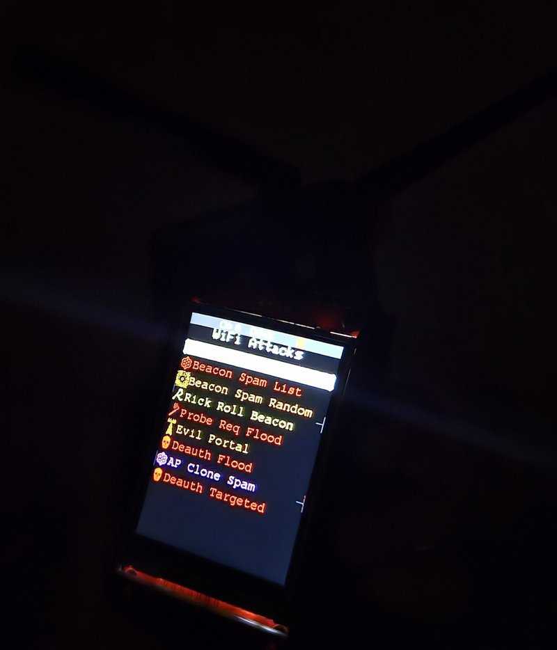

# 🛠️ ESP32 WiFi Marauder with SPI TFT Setup Guide

This project demonstrates how to convert a basic ESP32 Dev Board into a powerful wireless auditing tool using the open-source **WiFi Marauder** firmware. By pairing the ESP32 with a 2.8" SPI TFT LCD and optional antenna + power module, you can create a compact, portable, and touch-capable wireless scanner.

The setup allows you to perform:

* WiFi deauthentication and probe attacks
* Bluetooth device scanning
* Touchscreen interaction for menu navigation
* Real-time packet sniffing and signal strength mapping

In this guide, you’ll find step-by-step wiring instructions, supported components, flashing tools, and tips for building a 3D-printed enclosure for protection.

Ideal for pentesters, CTF players, or wireless hobbyists, this project is plug-and-play once assembled properly.

Let’s dive in!

This guide helps you install and assemble the **WiFi Marauder firmware** on your **ESP32 Dev Board** using a **2.8" SPI TFT LCD Display with Touch (ILI9341)**.

> ✅ This project is tested with the [REES52 2.8 inch TFT SPI ILI9341](https://amzn.in/d/eWJFB6g), which is fully compatible with WiFi Marauder.

---

## 🧩 Hardware Required

| Component                  | Example / Notes                                     |                    |
| -------------------------- | --------------------------------------------------- | ------------------ |
| ESP32 Dev Board            | [Buy on Amazon](https://amzn.in/d/fklWb1S)          |                    |
| 2.8" SPI TFT LCD (ILI9341) | [REES52 SPI TFT Display](https://amzn.in/d/eWJFB6g) |                    |
| Antenna for ESP32          | [Buy Antenna](https://amzn.in/d/fNsxlLy)            |                    |
| C-Type Power Module        | [Power Module](https://amzn.in/d/gkDIozV)           |                    |
| Jumper Wires               | Female-to-male                                      |                    |
| USB Cable                  | To flash the ESP32                                  | To flash the ESP32 |

---

## 🔌 Wiring (SPI TFT to ESP32 and Type-C Power Module)

| TFT Pin | Function        | ESP32 GPIO | Note                                |
| ------- | --------------- | ---------- | ----------------------------------- |
| VCC     | Power           | 3.3V/5V    | Depending on TFT support            |
| GND     | Ground          | GND        |                                     |
| CS      | TFT Chip Select | GPIO5      |                                     |
| RESET   | TFT Reset       | GPIO22     |                                     |
| DC/RS   | Data/Command    | GPIO21     |                                     |
| MOSI    | SPI MOSI        | GPIO23     |                                     |
| SCK     | SPI Clock       | GPIO18     |                                     |
| MISO    | SPI MISO        | GPIO19     | For SD/touch (optional)             |
| LED     | Backlight       | 3.3V       | Or connect to GPIO with PWM control |

---

### ⚡ Type-C Power Module Connection

| Type-C Module Pin | Connects To  |
| ----------------- | ------------ |
| Positive (VOUT)   | 5V on ESP32  |
| Negative (GND)    | GND on ESP32 |

---

## 🚀 Flashing WiFi Marauder

1. Visit the official [WiFi Marauder Web Updater](https://github.com/justcallmekoko/ESP32Marauder/wiki/update-firmware#using-spacehuhn-web-updater)
2. Connect your ESP32 to USB and select the COM port
3. Upload the files at these addresses:

| File Type  | Flash Address |
| ---------- | ------------- |
| Bootloader | `0x1000`      |
| Partitions | `0x8000`      |
| Boot App   | `0xE000`      |
| Firmware   | `0x10000`     |

> These offsets apply to most ESP32 Dev Boards like NodeMCU-32S, Wemos D1 Mini, LDDB, etc.

---

## 🔧 Drivers for ESP32

If your ESP32 does not appear on the COM port, install the CH34x drivers:

▶️ [Download CH34x Windows Driver](https://github.com/justcallmekoko/ESP32Marauder/blob/master/Drivers/CH34x_Install_Windows_v3_4.EXE)

---

## 🛑 Unsupported TFT Warning

Parallel 8-bit TFT displays (like the 2.4" Red Shields for Arduino UNO with pins `D0-D7`) are **NOT compatible** with WiFi Marauder. These require entirely different libraries and are not supported by the SPI-based firmware.

| Issue          | Description                                |
| -------------- | ------------------------------------------ |
| Interface Type | Parallel (8-bit)                           |
| Support        | ❌ Not supported by WiFi Marauder           |
| Fix            | Use SPI-based TFT like the REES52 2.8" TFT |

---

## 📸 Compatible Display (Tested)

Tested & confirmed working with WiFi Marauder. Connects via SPI. Includes touch functionality.

Amazon Link: [https://amzn.in/d/eWJFB6g](https://amzn.in/d/eWJFB6g)

---

## 🧱 3D Printed Case Option

To keep your ESP32 + TFT module safe and portable, you can design a custom 3D-printed case.

* 🔧 Platforms like [Thingiverse](https://www.thingiverse.com/) or [Printables](https://www.printables.com/) have community-contributed case designs.
* 🖨️ You can also use [Tinkercad](https://www.tinkercad.com/) to customize your own enclosure.
* 🛒 In my case, I ordered the 3D-printed case from [Robu.in](https://robu.in/), which offers printing services and enclosure design assistance for hobby electronics.

---

## 🙌 Credits

* [WiFi Marauder GitHub](https://github.com/justcallmekoko/ESP32Marauder)
* [TFT\_eSPI Library](https://github.com/Bodmer/TFT_eSPI) (for other projects)

---

## 🧾 License

This guide and documentation follow the MIT License in alignment with the original WiFi Marauder project.
